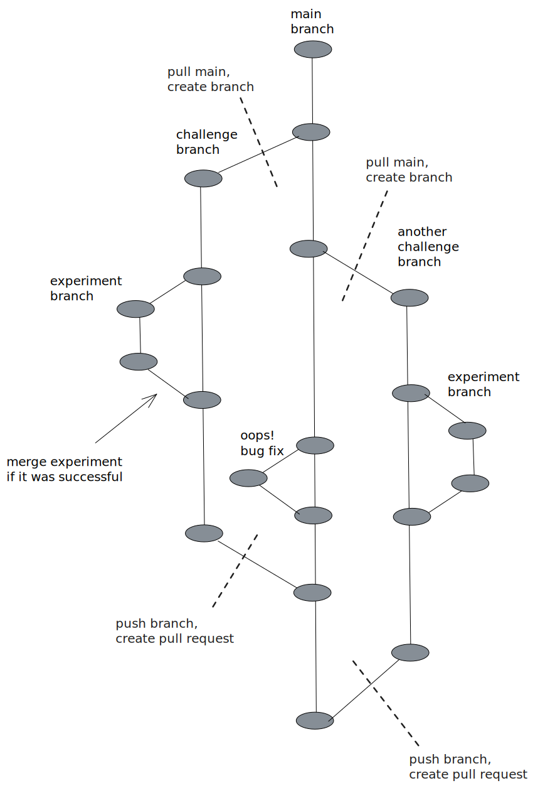
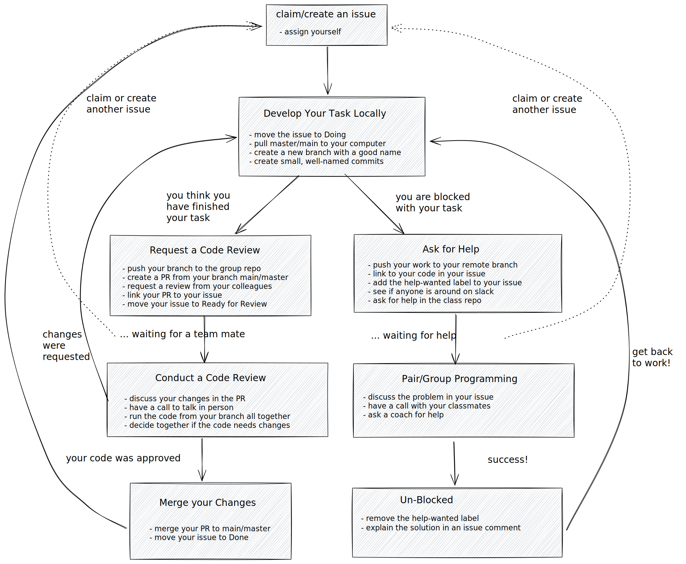

# Development

Everything is planned, the board is ready, it's time to get working. As you
develop your project, you will keep track of everything on the project board.

## `/notes`

This repository comes with a [/notes](./notes) directory with good notes on different topics covered in this repository. Your group can always add more! You can either send Pull Requests to the existing notes files, or start entirely new ones that support your group's objectives.

## Creating new Challenges

This repository comes with a collection of coding challenges, but you don't need limit yourself to only these! You are encouraged to add new algorithms or coding challenges inline with your group's objectives. The only rule is that you should follow the file & folder conventions that are already in place. The goal is to practice developing a quality, consistent code base in collaboration with others. What you develop is up to you!

## `help-wanted` Label

Add this label to your issue when you're blocked. Your team mates will be able
to see this on the project board or by filtering all the project issues.

## Opening New Issues

Issues are flexible, you can always create new issues or update existing ones
after the project has started. Up to now you have created issues for planned
tasks, but issues can be used for all sorts of tasks. Especially tasks that you
weren't able to plan for.

Some common reasons to create new issues:

- **Bugs**: if you find a _bug_ in the `master`/`main` branch you can open a new
  issue, describe the problem, and attach the `bug` label. Someone can claim the
  issue, fix the bug on a new branch, and open a PR.
- **Enhancements**: if you have an idea to improve code that _already exists_ in
  the `main`/`master` branch you can open a new issue, describe the changes you
  have in mind, and add the `enhancement` label. If some has time they can claim
  this issue, develop the enhancement on a new branch, and send a PR.
- **Discussion**: is something not clear about the project? Maybe your Strategy
  wasn't correct and you need to make some changes to the plan? Open a new
  issue, add the `discussion` label, and assign your team mates. Discussion
  issues probably won't have a linked PR. You can move them to _Done_ and close
  them when your team has come to a decision.

## Claim, Branch, Review, Merge

This is it, the real deal. Finally you can write some code!

You and your team mates will each work on one task at a time, asking for help
and tracking your progress with the project board.

You will be responsible for writing your code on a new branch, and your team
mates will be responsible for reviewing and merging your code to main/master. As
a team you should make your best effort to use _branches_ for organizing
your work. If you wrote a good development strategy you will already be half-way
there.

It will take a little while to get used to this workflow, but once you do
there's no going back:

### Branching Strategy

Your group's git branches should look something like this:

## Individual Workflow

Your individual workflow should look something like this:

